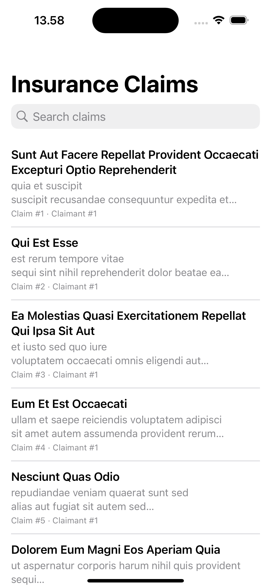
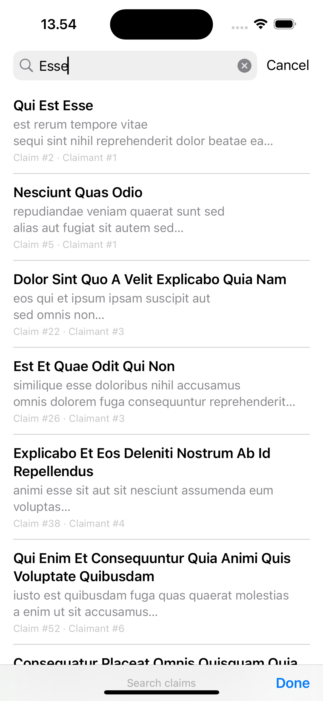
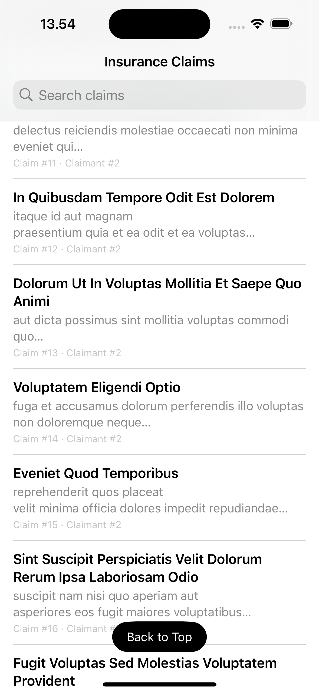
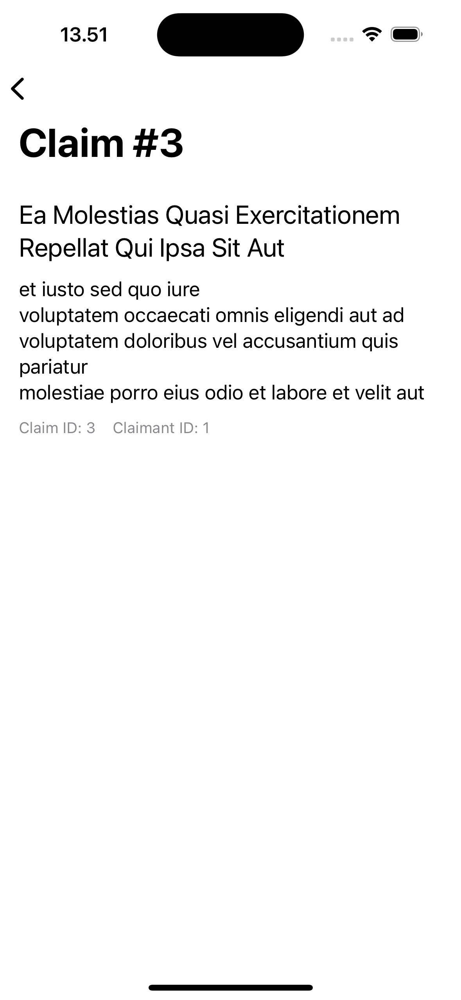
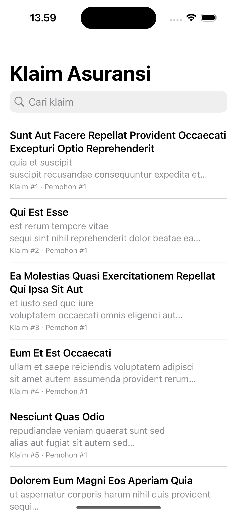

# Insurance Claims

[](https://github.com/restupratomo/testing-list-insurance-claims/actions/workflows/ci.yml)

An iOS app that lists and displays insurance claims, backed by the
[JSONPlaceholder](https://jsonplaceholder.typicode.com/posts) `/posts` endpoint
used as mock claims data.

## Screenshots

| Claims list | Search (min. 3 chars, debounced) | Back-to-top button |
| --- | --- | --- |
|  |  |  |

| Claim detail | List — Bahasa Indonesia | Detail — Bahasa Indonesia |
| --- | --- | --- |
|  |  |  |

The Indonesian screenshots were taken with the simulator's system language set
to Bahasa Indonesia — the app has no in-app language switch; it follows
Settings > General > Language & Region like any standard iOS app.

## Requirements

- Xcode 14+
- [Carthage](https://github.com/Carthage/Carthage)
- [XcodeGen](https://github.com/yonaskolb/XcodeGen) (used to generate the
  `.xcodeproj` from `project.yml` — the project file itself isn't committed,
  same as the Carthage build output)
- [SwiftLint](https://github.com/realm/SwiftLint) (runs as a build phase;
  the build just prints a warning and continues if it isn't installed)

## Setup

```bash
brew install xcodegen carthage swiftlint
Scripts/carthage.sh           # bootstraps Carthage dependencies as xcframeworks
xcodegen generate
open InsuranceClaims.xcodeproj
```

`Scripts/carthage.sh` wraps `carthage bootstrap --platform iOS
--use-xcframeworks --no-use-binaries` (the flags this project needs to build
cleanly on Apple Silicon); pass `update` instead of running it bare if you've
changed the `Cartfile` and need to re-resolve `Cartfile.resolved`.

Run the `InsuranceClaims` scheme to launch the app, or `Cmd+U` to run the
`InsuranceClaimsTests` (unit) and `InsuranceClaimsAPITests` (functional,
hits the live API) targets.

## Dependencies

All via Carthage ([`Cartfile`](Cartfile)), built as xcframeworks:

| Library | Used for |
| --- | --- |
| [Texture](https://github.com/TextureGroup/Texture) | The UI layer (`AsyncDisplayKit`) — off-main-thread layout for the claims list and detail screen |
| [Alamofire](https://github.com/Alamofire/Alamofire) | Networking, including certificate pinning via `ServerTrustManager` |
| [RxSwift](https://github.com/ReactiveX/RxSwift) | Debounced search, and exposing view model state as observables |
| [Localize-Swift](https://github.com/marmelroy/Localize-Swift) | English/Indonesian localized strings |
| [IQKeyboardManager](https://github.com/hackiftekhar/IQKeyboardManager) | App-wide keyboard avoidance |
| [Quick](https://github.com/Quick/Quick) / [Nimble](https://github.com/Quick/Nimble) | Test-only — BDD-style specs and matchers |

## Architecture

MVVM-C:

- **Models** — `Claim`, decoded directly from the API's `posts` shape.
- **Networking** — `APIClient` (Alamofire-based request/decode), `Endpoint`,
  `NetworkError`, `SSLPinningManager` (builds Alamofire's `ServerTrustManager`
  for certificate pinning).
- **Cache** — `ClaimCache`, a per-page, time-boxed on-disk cache so repeat
  visits render instantly; a page is treated as empty and re-fetched once its
  entry goes stale.
- **Services** — `ClaimService`, the single point that decides cache vs.
  network and is what view models talk to. Networking code never leaks into
  the presentation layer.
- **Scenes** — one folder per screen (`ClaimsList`, `ClaimDetail`), each with
  a view model (plain Swift, unit-testable without any UI framework) and a
  Texture (`AsyncDisplayKit`) view controller. `ClaimsListViewModel` exposes
  its state and visible claims as RxSwift `BehaviorRelay`-backed observables;
  the view controller subscribes to them instead of using change-callback
  closures.
- **Application** — `AppCoordinator` owns navigation between scenes so view
  controllers never push one another directly.

## Pagination & search

The list requests 10 claims per page via the API's `_page`/`_limit`
parameters and loads the next page automatically as the user scrolls near the
bottom. The search bar filters already-loaded claims by title or description;
it does not issue new network requests. Typing is gated to a minimum of 3
characters and debounced 300ms (via RxSwift) before the filter runs, so the
list isn't re-filtered on every keystroke. A rounded "Back to Top"/"Kembali ke
Atas" button appears once the list is scrolled past a threshold and scrolls
back to the first row when tapped.

## Localization

English and Bahasa Indonesia, via [Localize-Swift](https://github.com/marmelroy/Localize-Swift)
(`en.lproj`/`id.lproj` `Localizable.strings`). The active language always
follows the device's system language (Settings > General > Language &
Region) — there is no in-app switcher and no persisted override, matching
standard iOS app behavior.

## Keyboard handling

[IQKeyboardManager](https://github.com/hackiftekhar/IQKeyboardManager) is
enabled app-wide in `AppDelegate`, so the keyboard never covers a focused
text field or text view (currently the claims search field; automatically
covers any text input added later too) without each screen implementing its
own avoidance logic. Debug logging is explicitly disabled so it can't leak
view-hierarchy details to the console in a shipped build.

## Security hardening

- **TLS/certificate pinning** — `SSLPinningManager` configures Alamofire's
  `ServerTrustManager` with a custom evaluator that pins the API host's
  SubjectPublicKeyInfo hash, rejecting the connection if it doesn't match
  even when a rogue CA is trusted on the device. Rotate the pin in
  `SSLPinningManager` whenever the API's certificate is renewed with a new
  key pair (see the comment above `pinnedPublicKeyHashes`), and add a backup
  pin ahead of any planned rotation.
- **App Transport Security** — arbitrary loads are disabled; only the pinned
  host is allowed, over TLS 1.2+.
- **String obfuscation** — the API host and pinned key hash are stored
  XOR-masked (`ObfuscatedString`) rather than as plain string literals, so
  they don't show up directly under `strings` on the compiled binary.
- **No debug logging in shipped code** — IQKeyboardManager's debug mode
  (which would print view-hierarchy and responder-chain details on every
  keyboard event) is explicitly disabled; covered by a spec so it can't
  regress silently.
- **Release hardening** — bitcode is disabled, the release build strips
  debug symbols (`STRIP_STYLE=all`) and compiles as a single whole module,
  which removes per-file symbol boundaries that make reverse engineering
  easier.

## Testing

- **Unit tests** (`InsuranceClaimsTests`) — Quick/Nimble specs covering every
  layer: models, networking (`APIClient`'s error mapping against a stubbed
  `URLProtocol`), `SSLPinningManager`'s evaluator (against offline-generated
  EC/RSA/DSA test certificates), the cache, both view models, the coordinator,
  the Texture cell/content nodes, the list view controller's data source,
  delegate, back-to-top button and error-recovery paths, and the keyboard
  manager's hardening configuration — currently ~98% line coverage on the app
  target. The remaining uncovered lines are the `required init?(coder:)`
  boilerplate every `UIViewController` subclass with a custom `init` must
  implement — it calls `fatalError()`, so no test can invoke it without
  crashing the process. Every other branch, including defensive
  `Security`-framework guards that a valid certificate can't naturally
  trigger, is covered via dependency-injection seams (`APIClient.urlBuilder`,
  `SSLPinningManager.keyExtractor`, `AdaptiveColorEnvironment`).
- **Functional API tests** (`InsuranceClaimsAPITests`) — Quick/Nimble specs
  that call the live JSONPlaceholder API and assert on page size, field
  population and pagination behavior.

## Linting

[SwiftLint](https://github.com/realm/SwiftLint) runs as an Xcode build phase
(see `.swiftlint.yml`). It's non-blocking if SwiftLint isn't installed; run
`swiftlint lint` or `swiftlint lint --fix` from the repo root at any time to
check or auto-correct style locally.

## CI/CD

GitHub Actions (`.github/workflows/ci.yml`) runs on every push and pull
request to `main`/`master`:

- **Lint, build and unit test** — SwiftLint (`--strict`), then builds the app
  and runs `InsuranceClaimsTests` with code coverage enabled. This job must
  pass.
- **Functional API tests** — runs `InsuranceClaimsAPITests` against the live
  JSONPlaceholder API. Allowed to fail without blocking the pipeline, since a
  failure there can mean the third-party API is down rather than a
  regression in this repo.

Both jobs cache `Carthage/Build` keyed on `Cartfile.resolved`, so dependency
builds are skipped on unchanged commits.
